# 07 — Entity-Relationship Diagram

> Mermaid `erDiagram` (renders on GitHub, in our docs site, and in dbdiagram.io via import).

```mermaid
erDiagram
    USERS ||--o{ USER_PROFILES : "1:1"
    USERS ||--o{ USER_ROLES : "has"
    USERS ||--o{ USER_LOGINS : "OAuth"
    USERS ||--o{ REFRESH_TOKENS : "issues"
    USERS ||--o{ AUDIT_LOGS : "actor"
    USERS ||--o{ ENROLLMENTS : "enrolls"
    USERS ||--o{ USER_PACKAGE_ACCESS : "owns"
    USERS ||--o{ ORDERS : "places"
    USERS ||--o{ SUBMISSIONS : "submits"
    USERS ||--o{ ATTENDANCE : "joins"
    USERS ||--o{ CERTIFICATES : "earns"
    USERS ||--o{ XP_EVENTS : "earns XP"
    USERS ||--o{ STREAKS : "tracks"
    USERS ||--o{ NOTIFICATIONS : "receives"
    USERS ||--o{ PARENT_LINKS : "parent of"
    USERS ||--o{ PARENT_LINKS : "child of"
    USERS ||--o{ REFERRAL_CODES : "refers"
    USERS ||--o{ COUPON_REDEMPTIONS : "redeems"
    USERS ||--o{ WATCH_PROGRESS : "watches"
    USERS ||--o{ LIVE_SESSION_TOKENS : "join tokens"

    ROLES ||--o{ USER_ROLES : "scoped to"

    COURSES ||--o{ MODULES : "has"
    COURSES ||--o{ ENROLLMENTS : "has"
    COURSES ||--o{ MONTHLY_PACKAGES : "sells"
    COURSES ||--o{ LIVE_SESSIONS : "schedules"
    COURSES ||--o{ ASSIGNMENTS : "has"
    COURSES ||--o{ EXAMS : "has"
    COURSES ||--o{ QUIZZES : "has"
    COURSES ||--o{ CERTIFICATES : "awards"
    COURSES ||--o{ COURSE_REVIEWS : "rated by"

    MODULES ||--o{ LESSONS : "contains"
    LESSONS ||--o{ LESSON_VERSIONS : "versioned"
    LESSONS ||--o{ ATTACHMENTS : "has"
    LESSONS ||--o{ LESSON_PREREQUISITES : "requires"
    LESSONS ||--o{ WATCH_PROGRESS : "tracked"

    MONTHLY_PACKAGES ||--o{ USER_PACKAGE_ACCESS : "grants"
    MONTHLY_PACKAGES ||--o{ ORDERS : "purchased via"

    ORDERS ||--|| PAYMENTS : "paid by"
    ORDERS ||--o| INVOICES : "invoiced"
    ORDERS ||--o{ REFUNDS : "refunded"
    ORDERS ||--o{ COUPON_REDEMPTIONS : "applies"

    LIVE_SESSIONS ||--o{ ATTENDANCE : "tracks"
    LIVE_SESSIONS ||--o{ LIVE_SESSION_TOKENS : "issues"

    ASSIGNMENTS ||--o{ SUBMISSIONS : "collected"
    EXAMS ||--o{ SUBMISSIONS : "collected"
    QUIZZES ||--o{ SUBMISSIONS : "collected"
    SUBMISSIONS ||--o{ ANSWERS : "contains"

    QUESTION_BANKS ||--o{ QUESTIONS : "groups"
    QUESTIONS ||--o{ ANSWERS : "answered by"
    EXAMS ||--o{ EXAM_QUESTIONS : "selects"
    QUESTION_BANKS ||--o{ EXAM_QUESTIONS : "selects from"

    PROBLEMS ||--o{ TEST_CASES : "has"
    PROBLEMS ||--o{ CODE_SUBMISSIONS : "submitted to"
    CODE_SUBMISSIONS ||--o{ CODE_RESULTS : "per case"

    BADGES ||--o{ USER_BADGES : "earned"

    USERS {
        uuid id PK
        citext email
        citext email_normalized
        text password_hash
        timestamptz email_verified_at
        bool two_factor_enabled
        text two_factor_secret
        text locale
        text timezone
        enum status
        timestamptz last_login_at
        timestamptz created_at
        timestamptz updated_at
        timestamptz deleted_at
    }

    USER_PROFILES {
        uuid user_id PK
        text first_name
        text last_name
        text display_name
        text avatar_url
        text bio
        date birth_date
        char country_code
    }

    ROLES {
        uuid id PK
        text name
        text description
    }

    USER_ROLES {
        uuid id PK
        uuid user_id FK
        uuid role_id FK
        enum scope_type
        uuid scope_id
        timestamptz granted_at
        uuid granted_by
    }

    USER_LOGINS {
        uuid id PK
        uuid user_id FK
        text provider
        text provider_user_id
        citext provider_email
        timestamptz created_at
    }

    REFRESH_TOKENS {
        uuid id PK
        uuid user_id FK
        text token_hash
        timestamptz issued_at
        timestamptz expires_at
        timestamptz revoked_at
        uuid replaced_by
        text user_agent
        inet ip
    }

    AUDIT_LOGS {
        bigserial id PK
        uuid actor_user_id
        text action
        text subject_type
        text subject_id
        jsonb metadata
        inet ip
        text user_agent
        timestamptz created_at
    }

    COURSES {
        uuid id PK
        uuid teacher_id FK
        uuid school_id
        text slug
        text title
        text subtitle
        text description
        text cover_url
        text language
        enum level
        enum status
        text_array tags
        int enrollment_count
        numeric rating_avg
        int rating_count
        timestamptz published_at
    }

    MODULES {
        uuid id PK
        uuid course_id FK
        text title
        int order
        smallint month_number
    }

    LESSONS {
        uuid id PK
        uuid module_id FK
        text title
        int order
        enum kind
        enum visibility
        smallint estimated_minutes
        uuid_array prerequisites
    }

    LESSON_VERSIONS {
        uuid id PK
        uuid lesson_id FK
        int version
        text body_md
        jsonb body_json
        uuid created_by
        timestamptz created_at
    }

    ATTACHMENTS {
        uuid id PK
        uuid lesson_id FK
        enum kind
        text storage_key
        bigint size_bytes
        int duration_seconds
        text checksum
    }

    LESSON_PREREQUISITES {
        uuid lesson_id FK
        uuid prerequisite_lesson_id FK
    }

    ENROLLMENTS {
        uuid id PK
        uuid user_id FK
        uuid course_id FK
        timestamptz enrolled_at
        text source
        numeric progress_pct
        timestamptz last_active_at
        timestamptz completed_at
    }

    MONTHLY_PACKAGES {
        uuid id PK
        uuid course_id FK
        smallint month_number
        text title
        numeric price
        char currency
        smallint access_duration_days
        enum status
    }

    USER_PACKAGE_ACCESS {
        uuid id PK
        uuid user_id FK
        uuid package_id FK
        timestamptz granted_at
        timestamptz expires_at
        enum source
        uuid order_id
        timestamptz revoked_at
    }

    ORDERS {
        uuid id PK
        uuid user_id FK
        uuid package_id FK
        numeric amount
        char currency
        numeric discount_amount
        numeric total_amount
        enum status
        text paymob_order_id
        text idempotency_key
        jsonb metadata
    }

    PAYMENTS {
        uuid id PK
        uuid order_id FK
        text provider
        text provider_transaction_id
        text method
        numeric amount
        char currency
        enum status
        jsonb raw_payload
    }

    REFUNDS {
        uuid id PK
        uuid payment_id FK
        numeric amount
        text reason
        uuid requested_by
        enum status
    }

    INVOICES {
        uuid id PK
        uuid order_id FK
        text number
        text pdf_url
        timestamptz issued_at
    }

    COUPONS {
        uuid id PK
        citext code
        enum kind
        numeric value
        text applies_to
        int max_uses
        int used_count
        timestamptz valid_from
        timestamptz valid_to
        enum status
    }

    COUPON_REDEMPTIONS {
        uuid id PK
        uuid coupon_id FK
        uuid user_id FK
        uuid order_id FK
        timestamptz redeemed_at
    }

    REFERRAL_CODES {
        uuid id PK
        uuid user_id FK
        citext code
        text reward_type
        numeric reward_value
    }

    LIVE_SESSIONS {
        uuid id PK
        uuid course_id FK
        uuid teacher_id FK
        smallint month_number
        text title
        text description
        enum provider
        text organizer_url
        timestamptz start_at
        timestamptz end_at
        enum status
        text recording_url
    }

    LIVE_SESSION_TOKENS {
        uuid id PK
        uuid session_id FK
        uuid user_id FK
        text token_hash
        timestamptz expires_at
    }

    ATTENDANCE {
        uuid id PK
        uuid session_id FK
        uuid user_id FK
        timestamptz joined_at
        timestamptz left_at
        int duration_seconds
        inet ip
        text user_agent
        enum outcome
    }

    ASSIGNMENTS {
        uuid id PK
        uuid course_id FK
        uuid module_id
        uuid lesson_id
        text title
        text description_md
        numeric total_points
        timestamptz open_at
        timestamptz close_at
        int time_limit_minutes
        int attempts_allowed
        text grading_method
        jsonb settings
    }

    EXAMS {
        uuid id PK
        uuid course_id FK
        text title
        numeric total_points
        timestamptz open_at
        timestamptz close_at
        int time_limit_minutes
        int attempts_allowed
        jsonb settings
    }

    QUIZZES {
        uuid id PK
        uuid course_id FK
        text title
        numeric total_points
    }

    QUESTION_BANKS {
        uuid id PK
        uuid course_id FK
        text title
    }

    QUESTIONS {
        uuid id PK
        uuid bank_id FK
        enum kind
        text prompt_md
        jsonb prompt_json
        jsonb correct_answer
        numeric points
        smallint difficulty
        text bloom_level
        text_array topic_tags
        uuid created_by
    }

    EXAM_QUESTIONS {
        uuid exam_id FK
        uuid question_id FK
        int order
        numeric points
    }

    SUBMISSIONS {
        uuid id PK
        uuid assessment_id FK
        uuid user_id FK
        int attempt_number
        timestamptz submitted_at
        enum status
        numeric auto_score
        numeric manual_score
        numeric final_score
        uuid grader_user_id
        timestamptz graded_at
        jsonb rubric_scores
        text comments_md
        numeric similarity_score
    }

    ANSWERS {
        uuid id PK
        uuid submission_id FK
        uuid question_id FK
        jsonb answer_json
        bool is_correct
        numeric points_awarded
        text comments
    }

    PROBLEMS {
        uuid id PK
        text title
        text statement_md
        text_array languages
        int time_limit_ms
        int memory_limit_mb
        uuid created_by
    }

    TEST_CASES {
        uuid id PK
        uuid problem_id FK
        int order
        text input
        text expected_output
        bool is_sample
        numeric weight
    }

    CODE_SUBMISSIONS {
        uuid id PK
        uuid user_id FK
        uuid problem_id FK
        text language
        text source_code
        enum verdict
        int runtime_ms
        int memory_kb
        jsonb test_results
        timestamptz submitted_at
    }

    BADGES {
        text code PK
        text title
        text description
        text icon_url
        int xp_reward
    }

    USER_BADGES {
        uuid user_id FK
        text badge_code FK
        timestamptz awarded_at
    }

    XP_EVENTS {
        bigserial id PK
        uuid user_id FK
        text event_type
        int xp
        text source_id
        timestamptz created_at
    }

    STREAKS {
        uuid user_id PK
        int current_streak
        int longest_streak
        date last_active_date
        bool grace_used_this_week
    }

    CERTIFICATES {
        uuid id PK
        uuid user_id FK
        uuid course_id FK
        text verification_code
        text pdf_url
        timestamptz issued_at
    }

    NOTIFICATIONS {
        uuid id PK
        uuid user_id FK
        text kind
        text title
        text body
        jsonb payload
        timestamptz read_at
        timestamptz created_at
    }

    WATCH_PROGRESS {
        uuid id PK
        uuid user_id FK
        uuid lesson_id FK
        uuid attachment_id FK
        int last_position_seconds
        bool completed
        timestamptz updated_at
    }

    PARENT_LINKS {
        uuid id PK
        uuid parent_user_id FK
        uuid child_user_id FK
        text relationship
        enum status
        timestamptp created_at
    }
```

## Notes

- All FKs are non-identifying.
- Soft deletes are not shown to keep the diagram legible — every business table has `deleted_at`.
- Audit trail lives in `identity.audit_logs` (not duplicated per table).
- `enrollments` is the bridge between users and courses; a user is "subscribed" when
  they have an active `user_package_access` for at least one package in the course.
