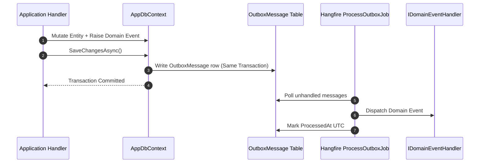
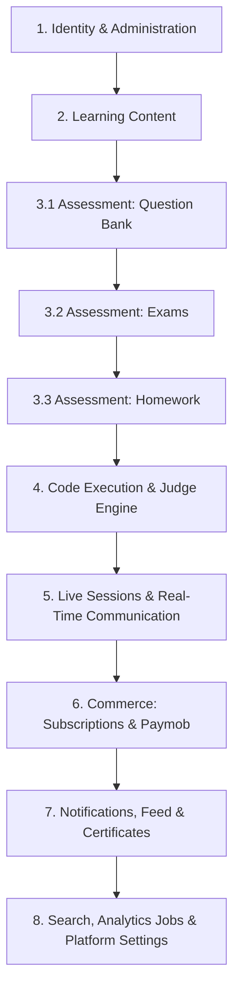
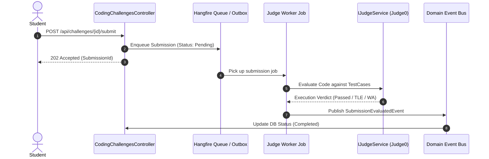

# Architecture-First Implementation Plan — Platform Backend

## Overview & Architectural Vision

This implementation plan refactors feature development from entity CRUD into **Task-Based Bounded Contexts**, adhering to Domain-Driven Design (DDD), Clean Architecture, Event-Driven Integration, and Enterprise Reliability patterns.

---

## Enterprise Resiliency & Cross-Cutting Architecture

### 1. Transactional Outbox Pattern (Event Delivery Guarantee)
To guarantee that Domain Events are **never lost** during database commits:
- `AggregateRoot.RaiseDomainEvent()` records events in-memory.
- EF Core `OutboxInterceptor` runs during `DbContext.SaveChangesAsync()`, converting domain events into `OutboxMessage` rows in the **exact same database transaction**.
- `ProcessOutboxJob` (Hangfire background worker running every 30s) reads unprocessed `OutboxMessage` records, deserializes the domain events, and dispatches them via `IDomainEventHandler`.
- Guarantees **At-Least-Once delivery** without blocking HTTP request execution.



---

### 2. Optimistic Concurrency Control (Data Integrity Guard)
To prevent silent overwrites when multiple users edit stateful resources concurrently:
- Entities subject to concurrent edits (`Course`, `Exam`, `Homework`, `Setting`, `StudentSubscription`) use EF Core Optimistic Concurrency Tokens (`RowVersion` / `uint Version` / `IsConcurrencyToken()`).
- When a concurrency conflict occurs, EF Core throws `DbUpdateConcurrencyException`.
- The `UnitOfWorkBehaviour` or exception handling middleware captures the exception and returns a typed `Error.Conflict("concurrency_conflict", "This resource was modified by another user. Please refresh and try again.")`.

---

## Key Architectural Principles

1. **Bounded Context Alignment**: Features are grouped by domain capability (`Identity`, `Learning`, `Assessment`, `Judge`, `Commerce`, `Communication`), not database tables.
2. **Task-Based Intention-Revealing Commands**: Avoid generic `UpdateEntity` CRUD. Commands express explicit business intent (`PublishExam`, `ChangeExamAvailability`, `GradeHomeworkSubmission`, `CompleteLesson`).
3. **Event-Driven Integration**: Cross-domain side effects (notifications, auditing, stats updates) are triggered asynchronously via **Domain Event Handlers** (`HomeworkSubmittedEvent` → `SendNotificationHandler` → Push/Email/DB).
4. **Asynchronous Non-Blocking Workers**: Long-running workloads (Judge code evaluation, Analytics snapshots) execute asynchronously via background workers (Hangfire) and event callbacks instead of blocking HTTP request threads.
5. **Contextual File Validation**: File uploads are domain-scoped (`UploadAvatarCommand`, `UploadLessonVideoCommand`, `UploadHomeworkAttachmentCommand`) enforcing distinct file-type, size, and virus scan constraints.
6. **Webhook Idempotency**: Payment & external webhooks implement strict idempotency guards against duplicate webhooks.
7. **Granular Controllers**: REST controllers are fine-grained (`CoursesController`, `CourseModulesController`, `LessonsController`, `LessonVideosController`) avoiding monolithic 30-endpoint controllers.
8. **Integration Testing (`Platform.Api.IntegrationTests`)**: API testing utilizes `WebApplicationFactory<Program>` with a test database for realistic end-to-end endpoint verification.

---

## Bounded Context Roadmap



---

### Phase 1: Identity & Administration Context
**Domain Scope**: User accounts, Teacher/Student/Admin profile personalization, status lifecycle.

#### Task-Based Use Cases
- `UpdateTeacherBioCommand` (Bio, social links, qualifications)
- `UpdateStudentAcademicProfileCommand` (Grade level, school name, parent contact)
- `ActivateUserCommand`, `DeactivateUserCommand` (Account lockout & status management)
- `AssignUserRoleCommand` (Role adjustments)
- `GetUsersPagedQuery` (Filter by role, status, search string, with `PaginatedList`)
- `UploadUserAvatarCommand` (Image mime-type validation, max 5MB, R2 storage upload)

#### Granular API Controllers
- `UsersController.cs` (`api/users`) — User management & search
- `TeacherProfilesController.cs` (`api/teachers`) — Public & private teacher profiles
- `StudentProfilesController.cs` (`api/students`) — Student academic profiles

---

### Phase 2: Learning Content Context
**Domain Scope**: Course creation, curriculum structure, lesson media, student progress tracking.

#### Task-Based Use Cases
- `PublishCourseCommand`, `ArchiveCourseCommand`, `UpdateCourseDetailsCommand` (with Concurrency Token)
- `ReorderCourseModulesCommand`, `CreateCourseModuleCommand`, `RenameCourseModuleCommand`
- `AttachLessonVideoCommand` (Video file validation, max 2GB, chunked R2 upload)
- `AttachLessonResourceCommand` (PDF/ZIP attachment validation)
- `CompleteLessonCommand` (Marks lesson completion, raises `LessonCompletedEvent` via Outbox)
- `UpdateVideoProgressCommand` (Tracks timestamp playback position)
- `GetCourseCatalogPagedQuery`, `GetCourseCurriculumQuery`, `GetLessonStreamDetailsQuery`

#### Granular API Controllers
- `CoursesController.cs` (`api/courses`) — Course catalog & metadata
- `CourseModulesController.cs` (`api/courses/{courseId}/modules`) — Curriculum modules
- `LessonsController.cs` (`api/lessons`) — Individual lesson playback & details
- `LessonResourcesController.cs` (`api/lessons/{lessonId}/resources`) — File attachments
- `StudentProgressController.cs` (`api/progress`) — Student progress dashboard

---

### Phase 3: Assessment Context (Sub-Phases)

#### Phase 3.1: Question Bank Bounded Sub-Context
- `CreateQuestionBankCommand`, `AddQuestionToBankCommand`
- `UpdateQuestionChoicesCommand`, `AttachQuestionImageCommand`
- `GetQuestionBanksPagedQuery`, `GetQuestionsByBankQuery`
- **Controller**: `QuestionBanksController.cs` (`api/question-banks`)

#### Phase 3.2: Exam & Automated Grading Bounded Sub-Context
- `CreateExamCommand`, `PublishExamCommand`, `ChangeExamAvailabilityCommand` (with Concurrency Token)
- `StartExamAttemptCommand` (Creates attempt timer)
- `SubmitExamAnswerCommand` (Records answer choice)
- `FinishExamAttemptCommand` (Triggers instant auto-grading for MCQs, raises `ExamAttemptCompletedEvent` via Outbox)
- `GetExamsPagedQuery`, `GetExamAttemptResultQuery`
- **Controllers**:
  - `ExamsController.cs` (`api/exams`)
  - `ExamAttemptsController.cs` (`api/exam-attempts`)

#### Phase 3.3: Homework & Manual Evaluation Sub-Context
- `CreateHomeworkCommand`, `PublishHomeworkCommand` (with Concurrency Token)
- `UploadHomeworkAttachmentCommand` (Student submission upload)
- `GradeHomeworkSubmissionCommand` (Teacher grade + feedback score, raises `HomeworkGradedEvent` via Outbox)
- `GetHomeworkListQuery`, `GetHomeworkSubmissionsQuery`
- **Controller**: `HomeworkController.cs` (`api/homework`)

---

### Phase 4: Code Execution & Judge Engine Context (Async Worker Pattern)
**Architecture**: Asynchronous queue pattern via Hangfire background worker.



#### Task-Based Use Cases
- `CreateCodingChallengeCommand`, `UpdateChallengeTestCasesCommand`
- `SubmitCodeChallengeCommand` (Enqueues evaluation job, returns 202 Accepted)
- `ProcessJudgeSubmissionJob` (Background job: calls `IJudgeService`, evaluates test cases, updates status)
- `GetCodingChallengesPagedQuery`, `GetSubmissionStatusQuery`
- **Controllers**:
  - `CodingChallengesController.cs` (`api/coding-challenges`)
  - `CodingSubmissionsController.cs` (`api/coding-submissions`)

---

### Phase 5: Live Sessions & Real-Time Communication Context
**Domain Scope**: Session scheduling, meeting room creation, attendance tracking.

#### Task-Based Use Cases
- `ScheduleLiveSessionCommand` (Calls `ILiveSessionProvider` for Teams/Meet URL)
- `RescheduleLiveSessionCommand`, `CancelLiveSessionCommand`
- `RecordAttendanceCommand` (Captures student join/leave logs)
- `GetUpcomingLiveSessionsQuery`, `GetLiveSessionAttendanceQuery`
- **Controller**: `LiveSessionsController.cs` (`api/live-sessions`)

---

### Phase 6: Commerce Context (Subscriptions, Paymob & Webhook Idempotency)
**Architecture**: Webhook idempotency protection against duplicate PSP events.

#### Task-Based Use Cases
- `CreateSubscriptionPlanCommand`, `ChangePlanStatusCommand`
- `InitiateSubscriptionCheckoutCommand` (Generates Paymob payment token)
- `ProcessPaymobWebhookCommand` (Checks `PaymobTransactionId` idempotency cache/DB log; if new: activates `StudentSubscription`, generates `Payment` & `Invoice`, raises `PaymentProcessedEvent` via Outbox)
- `GetSubscriptionPlansQuery`, `GetMyInvoicesQuery`
- **Controllers**:
  - `SubscriptionsController.cs` (`api/subscriptions`)
  - `PaymentsController.cs` (`api/payments`)
  - `PaymobWebhookController.cs` (`api/webhooks/paymob`)

---

### Phase 7: Communication, Feed & Certificates Context
**Architecture**: Pure Event-Driven Notification Handlers (`IDomainEventHandler`).

#### Task-Based Use Cases
- **Domain Event Handlers**:
  - `UserRegisteredEventHandler` → Sends Email Verification
  - `HomeworkGradedEventHandler` → Sends Student Notification + Parent Email
  - `ExamAttemptCompletedEventHandler` → Stores Notification + Calculates Score Badge
  - `PaymentProcessedEventHandler` → Sends Receipt Email + Push Notification
- `CreateAnnouncementCommand`, `PublishAnnouncementCommand`
- `IssueCertificateCommand` (Renders PDF via QuestPDF, stores R2 URL, raises `CertificateIssuedEvent` via Outbox)
- `GetMyNotificationsQuery`, `VerifyCertificateQuery` (Public verification link)
- **Controllers**:
  - `NotificationsController.cs` (`api/notifications`)
  - `AnnouncementsController.cs` (`api/announcements`)
  - `CertificatesController.cs` (`api/certificates`)

---

### Phase 8: Search, Automated Jobs & Platform Settings
**Domain Scope**: Infrastructure capabilities, search indexing, automated stats.

#### Task-Based Use Cases
- `GlobalSearchQuery` (Elasticsearch integration across courses, challenges, lessons)
- `GenerateAnalyticsSnapshotJob` (Hangfire Cron Job running every night at midnight)
- `UpdatePlatformSettingsCommand`, `UpdateTeacherSettingsCommand` (with Concurrency Token)
- **Controllers**:
  - `SearchController.cs` (`api/search`)
  - `SettingsController.cs` (`api/settings`)
  - `AnalyticsController.cs` (`api/analytics`)

---

## Verification Plan

### Integration & Unit Testing
1. For every bounded context phase, unit test Application handlers in `Platform.Application.UnitTests`.
2. Implement `Platform.Api.IntegrationTests` using `WebApplicationFactory` to test real HTTP endpoints, status codes, and JSON responses.
3. Run full automated suite:
```bash
dotnet test backend/Platform.slnx
```

### Goal
Maintain 100% green tests across all solution layers.
